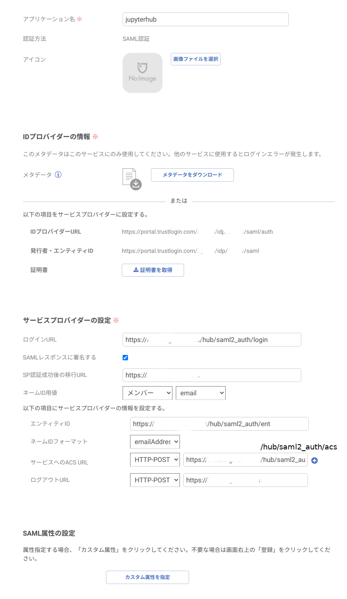

# SAML2 Authenticator for JupyterHub (TrustLogin version)

JupyterHubを[TrustLogin](https://trustlogin.com/)のSAML認証で使うための認証モジュールです。

[オリジナル版](https://github.com/ImperialCollegeLondon/jupyter_saml2authenticator)は、
AzureADとの接続を意識した作りになっており、TrustLoginが返してくるNameIDをユーザ名として拾ってくれないため、
これを改修しました。

具体的には、内部で使っているpysaml2では、NameIDをget_subject()で取れるので、これをユーザ名として扱うようにしました。

https://github.com/IdentityPython/pysaml2/blob/master/src/saml2/response.py#L737

https://gist.github.com/jpf/67076180b9766f54c430#file-app-py-L123

IdPが返してくるNameIDをユーザ名とするのであれば、TrustLogin以外のIdP（IDaaS）の認証にも使えると思います。

## Installation

依存モジュールについては、動作確認時のバージョンを、requirements.txtに記載しています。

このモジュール自体は、githubからpipで以下のように入れます。

```pip install git+git://github.com/mnagaku/jupyter_saml2authenticator```

## Setup

### TrustLogin



### Configure the authenticator

jupyterhub_config.pyの設定例

```python
from jupyter_saml2authenticator import LocalSaml2Authenticator
c.JupyterHub.authenticator_class = LocalSaml2Authenticator

site_top = 'https://hogehoge.com'

c.LocalSaml2Authenticator.saml2_metadata_filename = '/etc/jupyterhub/from-trustlogin-metadata.xml'
c.LocalSaml2Authenticator.saml2_entity_id = site_top+'/hub/saml2_auth/ent'
#c.LocalSaml2Authenticator.saml2_attribute_username = 'http://schemas.xmlsoap.org/ws/2005/05/identity/claims/name'

c.LocalSaml2Authenticator.create_system_users = True
c.LocalSaml2Authenticator.delete_invalid_users = True
```

from-trustlogin-metadata.xmlはTrustLoginの設定画面からダウンロードできるメタデータです。
saml2_attribute_usernameを設定すると、オリジナル版と同じ挙動となります。

